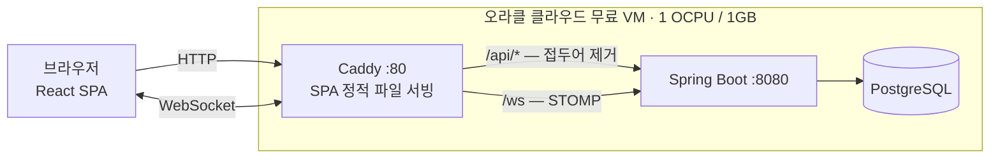

# TaskBoard

작업(이슈) 관리 · 실시간 협업 · 배포(릴리즈) 관리를 한곳에서 다루는 사내 협업 툴.

Jira 스타일의 이슈 목록에 **월간 캘린더**, **접속자 표시**, **배포·패치노트**, **관리자/모니터링 앱**을 더했다. 프레임워크가 주는 기본기 위에 필요한 것만 직접 만들었고, 라이브러리를 하나 더 넣을지 말지는 매번 근거를 남기며 정했다.


---

## 왜 만들었나

**혼자 쓰는 실무 도구이자 포트폴리오**로 만들었다. 두 목적이 설계를 계속 잡아당겼다.

실무 도구라서 "만들다 만 기능"을 남길 수 없었고, 포트폴리오라서 **왜 그렇게 했는지 설명할 수 없는 선택은 하지 않으려** 했다. 그래서 라이브러리를 넣을 때마다 "이게 없으면 몇 줄을 써야 하나"를 먼저 따졌고, 대부분은 직접 만드는 쪽이 짧았다.

---

## 주요 기능

| | |
|---|---|
| **작업 관리** | 상태·타입·우선순위·담당자·기간, 부분 수정, 라벨 |
| **홈 캘린더** | 담당 작업의 기간을 월 그리드에 막대로 배치, 개인 일정 추가 |
| **실시간 협업** | 접속자 표시, 작업·댓글 변경을 STOMP로 브로드캐스트 |
| **배포 관리** | 완료된 작업을 묶어 버전 발행, 패치노트, 배포 취소 |
| **알림** | 내 작업에 댓글이 달리면 헤더 종에 실시간 푸시 |
| **게스트 로그인** | DB에 계정을 만들지 않는 읽기 전용 신원 |
| **관리자 앱** | 프로젝트·멤버·계정·전역 상태/타입 관리 |
| **모니터링 앱** | 요청/에러/응답시간 집계, 서버 자원, 실시간 로그 스트리밍 |

<details>
<summary>화면 더 보기</summary>

**로그인** — 좌측에서 진입할 앱을 고르고, 게스트로 둘러볼 수도 있다


**작업 목록** — 배포된 작업에는 상태 옆에 릴리즈 버전이 붙는다


**작업 상세** — 즉시 저장, 댓글, 실시간 반영


**배포** — 완료된 작업을 골라 버전과 패치노트를 발행한다


**모니터링** — 요청 통계, 서버 자원, 실시간 로그


**관리자 — 계정 관리** — 공개 회원가입이 없어 계정은 여기서만 만들어진다


</details>

---

## 아키텍처



외부에 열린 포트는 Caddy의 80 하나뿐이다. DB와 백엔드는 컨테이너 네트워크로만 통신하고 호스트 포트를 열지 않는다.

**변경은 REST로, 그 결과는 WebSocket으로.** WebSocket 채널은 발행 전용이라 쓰기 경로가 하나로 유지된다. 브로드캐스트는 `@TransactionalEventListener(AFTER_COMMIT)`으로 커밋 이후에만 나간다 — 롤백된 변경이 남의 화면에 보이면 안 되기 때문이다.

**Caddy가 same-origin을 만든다.** `/api/*`는 접두어를 벗겨 백엔드로, `/ws`는 그대로, 나머지는 SPA 정적 파일로 보낸다. 이 규칙이 개발 서버(`vite.config.ts`)의 프록시와 같아서 **프론트 코드는 개발과 운영에서 완전히 같은 경로를 쓴다.** 절대 URL도, CORS 설정도, WSS 크로스오리진 인증도 필요 없다.

**빌드는 CI에서만 한다.** 1GB VM에서 Gradle을 돌리면 OOM이 난다. jar와 프론트 `dist`를 GitHub Actions에서 만들어 amd64/arm64 이미지로 GHCR에 올리고, 서버는 받아서 실행만 한다. 프론트 `dist`는 Caddy 이미지 안에 담아, 정적 파일을 서버로 옮기는 경로 자체를 없앴다.

---

## 기술 선택과 이유

| 영역 | 선택 | 이유 |
|---|---|---|
| 프론트 | React 19 + TypeScript + Vite | |
| 서버 상태 | TanStack Query | 캐시·무효화가 실시간 브로드캐스트와 맞물린다 |
| 스타일 | Tailwind CSS | |
| 실시간 | `@stomp/stompjs` (네이티브 WebSocket) | |
| 백엔드 | Java 17 + Spring Boot 3 | 처음엔 21로 잡았으나 **21 전용 기능을 하나도 쓰지 않아** 17로 낮췄다. 가상 스레드를 도입하면 재검토 |
| DB | PostgreSQL | MariaDB에서 전환. 무료 호스팅 선택지가 훨씬 넓다. 네이티브 쿼리가 하나도 없어 **전환 비용이 의존성 1줄 + 설정 3줄**이었다 |
| 인증 | Spring Security + JWT | 무상태라 서버를 늘려도 세션 공유가 필요 없다 |
| 실시간 | Spring WebSocket + STOMP 내장 브로커 | |
| 테스트 | JUnit 5 + Mockito + MockMvc + H2 | 79건 |
| 배포 | Docker Compose + Caddy + GHCR | |

### 쓰지 않기로 한 것들

넣지 않은 이유를 남기는 편이, 넣은 이유를 남기는 것보다 이 프로젝트를 더 잘 설명한다.

| 안 쓴 것 | 대신 | 이유 |
|---|---|---|
| **Redis** | 내장 Simple Broker + 메모리 집계 | 단일 서버에서는 필요가 없다. 다중 서버로 갈 때 도입하면 되고, 그 전까지는 운영 대상만 늘어난다 |
| **Actuator / Micrometer** | HandlerInterceptor 기반 직접 집계 | 필요한 지표가 4개뿐이라, 의존성과 설정을 들이는 것보다 직접 세는 게 짧았다 |
| **차트 라이브러리** | 60줄짜리 SVG | 막대 + 라인 하나뿐이다. 번들도 늘지 않는다 |
| **캘린더 라이브러리** | 순수 날짜 계산 + CSS Grid | 월 그리드와 여러 날짜짜리 막대 배치(lane 알고리즘)를 직접 구현했다 |
| **아이콘 라이브러리** | 직접 그린 SVG 선 아이콘 | 9개뿐이라 한 파일로 충분하다. `currentColor`를 써서 글자 색·크기를 그대로 따라간다 |
| **상태관리(Zustand 등)** | TanStack Query + `useState` | 서버 상태는 Query가, 나머지는 지역 상태로 충분한 규모다 |
| **UI 킷(shadcn/ui 등)** | Tailwind 직접 스타일링 | |
| **SockJS** | 네이티브 WebSocket | Vite에서 `global` 폴리필이 필요한데, 대상 브라우저가 모두 WebSocket을 지원한다 |
| **Testcontainers** | H2 (`MODE=PostgreSQL`) | 개발 머신에 Docker가 없었다. 네이티브 쿼리가 없어 호환성 위험이 낮다고 판단했다 — **한계도 그대로 안고 간다** |

---

## 설계에서 신경 쓴 것

**바꿀 수 있는 값에 로직을 묶지 않기.** "배포 완료" 판정을 상태 이름이 아니라 `releaseId`의 존재로 한다. 상태 이름은 관리자가 언제든 바꿀 수 있어서, 이름에 기대면 관리자가 오타 하나로 집계를 망가뜨릴 수 있다. 배포 후 옮길 상태도 서버가 추측하지 않고 화면에서 고른 id를 그대로 받는다.

**"값을 안 보냄"과 "null로 지움"을 구분하기.** 담당자·시작일·마감일은 **비우는 것이 정상적인 조작**이다. 부분 수정에서 이 둘을 같게 다루면 담당자를 지울 수 없거나, 제목만 바꿔도 날짜가 날아간다. Jackson이 JSON에 키가 있을 때만 setter를 호출한다는 점을 이용해 전달 여부를 기록한다.

**OSIV에 기대지 않기.** 작업 삭제 이벤트만 브로드캐스트되지 않던 버그가 있었다. 원인은 응답 DTO가 LAZY 컬렉션을 그대로 들고 있었던 것 — REST에서는 OSIV가 세션을 열어둬 우연히 동작했고, **WebSocket 직렬화 시점에는 세션이 없어** 조용히 실패했다. DTO를 만들 때 컬렉션을 복사하도록 고치고 회귀 테스트를 남겼다. 같은 종류의 버그를 테스트가 하나 더 잡았다(`CardService.list`에 트랜잭션이 없던 문제).

**게스트를 DB에 남기지 않기.** 혼자서 실시간 기능을 검증하려면 동시 접속자가 둘 이상 필요했다. 게스트는 User 테이블에 저장하지 않고 JWT 클레임만으로 인증하며, id를 **음수로 발급**해 실제 사용자와 절대 겹치지 않게 했다. 읽기 전용은 화면이 아니라 `SecurityConfig`에서 강제한다.

**공개 서버 기준으로 인증을 다시 정하기.** 로컬에서만 쓰던 전제(누구나 가입, 시도 횟수 무제한, API 문서 공개)를 공개 배포에 맞춰 되짚었다. 로그인 시도 제한은 IP가 아니라 **아이디 기준**으로 뒀는데, Caddy 뒤에서 실제 IP를 알려면 `X-Forwarded-For`를 신뢰해야 하고 그 신뢰 자체가 새로운 가정이 되기 때문이다. 대신 남의 아이디를 일부러 잠글 수 있다는 트레이드오프가 있어 잠금은 짧게만 건다.

---

## 로컬 실행

**JDK 17**과 **PostgreSQL**이 필요하다. Gradle 툴체인이 정확히 17을 요구하고 자동 다운로드는 꺼져 있어, 다른 버전만 있으면 `Cannot find a Java installation`으로 실패한다.

`taskboard` DB를 만들어 두고(접속 정보 기본값은 `postgres` / `1234`, 환경변수로 덮어쓸 수 있다):

```bash
cd backend && BOOTSTRAP_ADMIN_USERNAME=admin BOOTSTRAP_ADMIN_PASSWORD=<8자 이상> ./gradlew bootRun
```

```bash
cd frontend && npm install && npm run dev
```

공개 회원가입이 없으므로 첫 관리자는 위 환경변수로 만든다. 계정이 이미 있으면 이 값은 무시된다.

테스트는 H2 인메모리로 돌아가 별도 준비가 필요 없다.

```bash
cd backend && ./gradlew test
```

---

## 문서

| | |
|---|---|
| [DEPLOY.md](DEPLOY.md) | 배포·운영 절차, 서버 준비, 인스턴스 이전 |
| [프로젝트_기획서.md](프로젝트_기획서.md) | 기능 명세, 설계 경위, 변경 이력, 잡은 버그 기록 |
