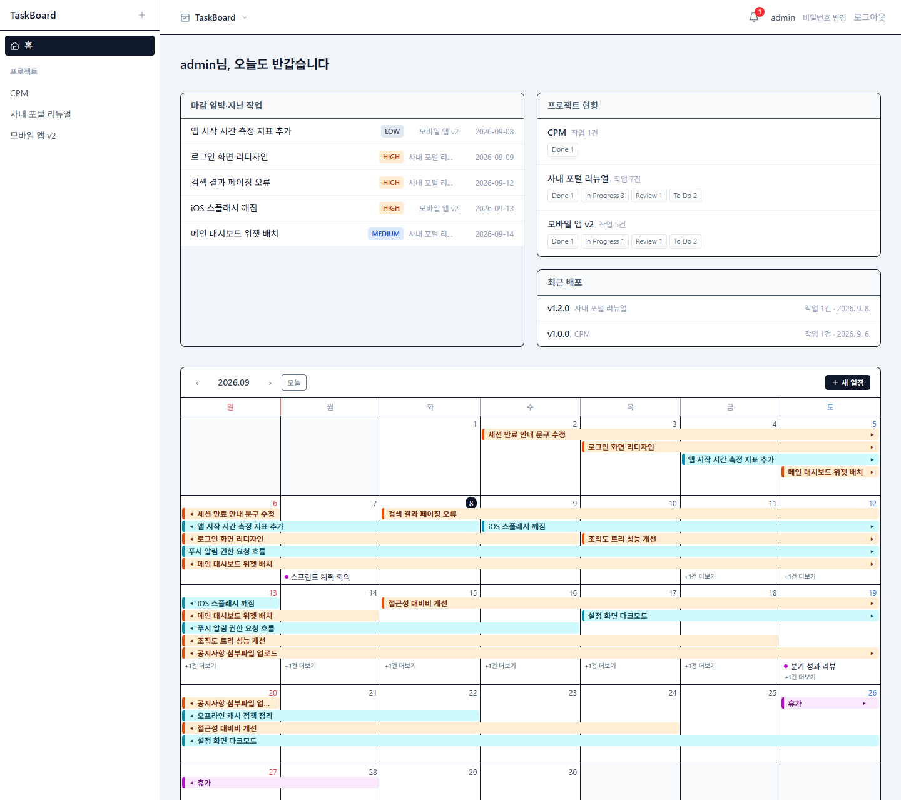
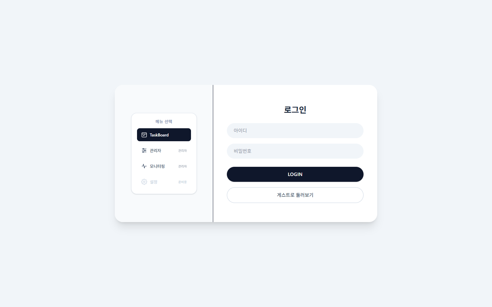
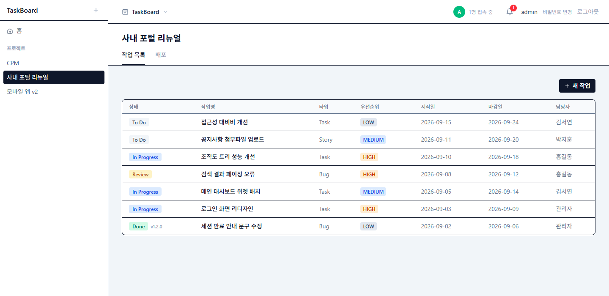
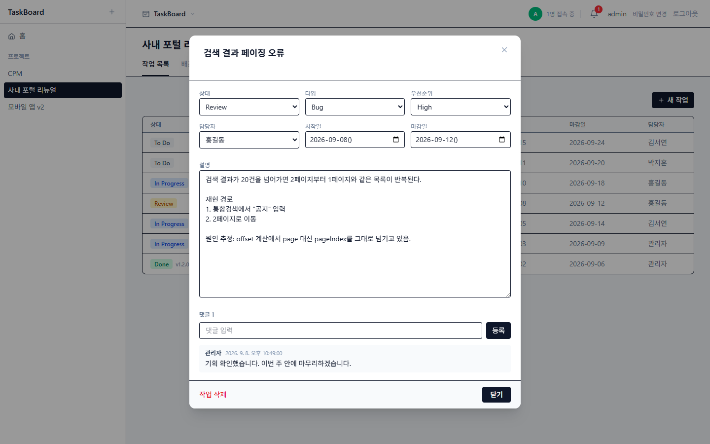
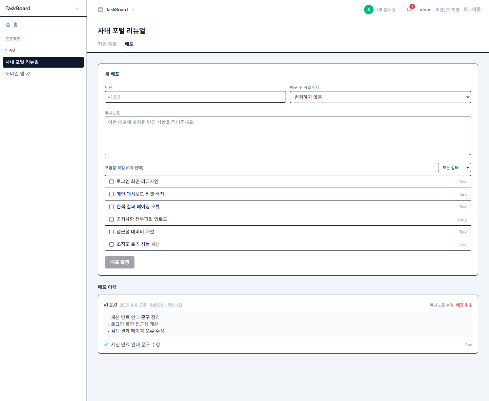
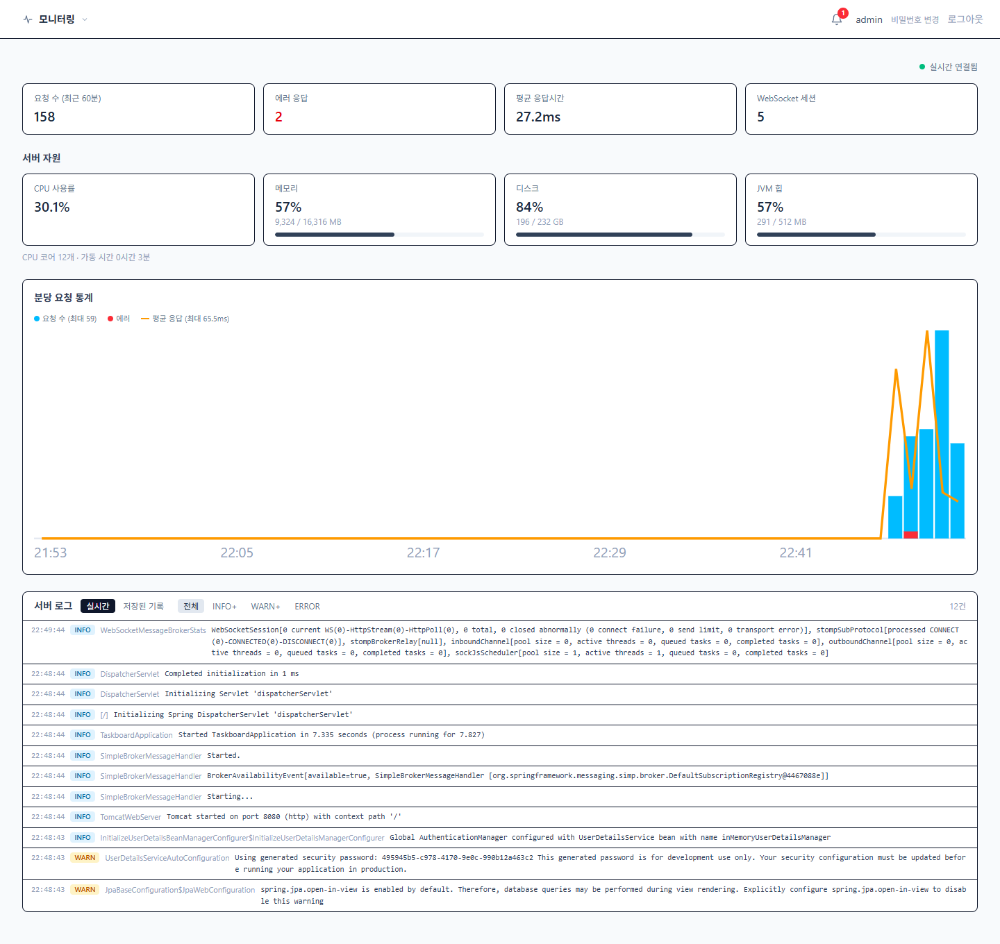
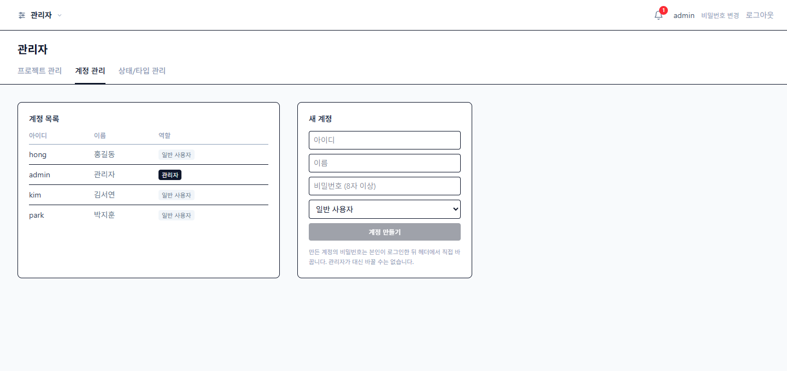
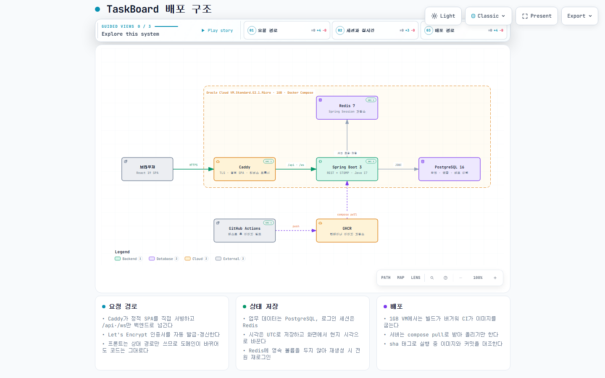

# TaskBoard

작업 관리 · 일정 · 배포(릴리즈) 관리를 한곳에서 다루는 작업 관리 툴

> **라이브 데모** — https://129-225-171-106.sslip.io
> 로그인 화면의 **게스트로 둘러보기**로 계정 없이 읽기 전용으로 들어갈 수 있습니다.

 

## 주요 기능

| 기능 | 설명 |
|---|---|
| **작업 관리** | 상태·타입·우선순위·담당자·기간 관리, 필드별 즉시 저장 |
| **홈 캘린더** | 작업 기간을 월 그리드에 막대로 배치, 개인 일정 추가 |
| **실시간 반영** | 접속자 표시, 작업·댓글 변경을 다른 접속자 화면에 즉시 반영 |
| **배포 관리** | 완료된 작업을 묶어 버전 발행, 패치노트 작성, 배포 취소 |
| **알림** | 내 작업에 댓글이 달리면 헤더에 실시간 알림 |
| **게스트 로그인** | 계정 없이 둘러보는 읽기 전용 모드 |
| **관리자 앱** | 프로젝트·멤버·계정 관리, 작업 상태·타입 설정 |
| **모니터링 앱** | 요청·에러·응답시간, 서버·백엔드·DB 자원, 실시간 로그 |

<b>화면 더 보기</b>

 

**로그인** — 진입할 앱을 고르거나 게스트로 둘러볼 수 있다

**작업 목록** — 배포된 작업은 상태 옆에 릴리즈 버전이 붙는다

**작업 상세** — 저장 버튼 없이 즉시 저장, 댓글, 실시간 반영

**배포** — 완료된 작업을 골라 버전과 패치노트를 발행한다

**모니터링** — 요청 통계, 자원 사용량, 실시간 로그

**계정 관리** — 공개 회원가입이 없어 계정은 관리자만 만든다

 

## 아키텍처

> 노드를 따라가며 볼 수 있는 인터랙티브 버전: [docs/architecture.html](docs/architecture.html) (내려받아 브라우저로 열기)

- **쓰기는 REST, 결과 전파는 WebSocket** — 변경은 REST로만 받고, 커밋이 끝난 뒤에만 STOMP로 브로드캐스트한다. 롤백된 변경이 다른 사람 화면에 보이지 않는다.
- **Caddy가 하나의 오리진을 만든다** — 정적 SPA는 Caddy가 직접 서빙하고 `/api`·`/ws`만 백엔드로 넘긴다. 개발 서버(Vite) 프록시와 규칙이 같아 프론트 코드는 개발·운영에서 똑같다. CORS 설정이 필요 없다.
- **세션은 Redis에** — 로그인은 쿠키 기반 세션이고 저장소는 Redis다. 백엔드를 재배포해도 로그인이 유지된다.
- **빌드는 CI에서만** — 1GB VM에서는 빌드가 버거워 GitHub Actions가 이미지를 만들어 GHCR에 올리고, 서버는 받아서 실행만 한다.

 

## 기술 스택

| 영역 | 사용 기술 | 비고 |
|---|---|---|
| **프론트엔드** | React 19 · TypeScript · Vite · Tailwind CSS | |
| 서버 상태 | TanStack Query · axios | 실시간 이벤트를 받으면 재요청 없이 캐시에 바로 반영 |
| 실시간 | `@stomp/stompjs` | 네이티브 WebSocket |
| **백엔드** | Java 17 · Spring Boot 3 | |
| 인증 | Spring Security · Spring Session | 처음엔 JWT였으나, 토큰을 브라우저에 두지 않으려고 세션으로 전환 |
| 실시간 | Spring WebSocket · STOMP 내장 브로커 | |
| **데이터** | PostgreSQL 16 · Redis 7 | Redis는 세션 저장 전용 |
| **인프라** | Docker Compose · Caddy · GitHub Actions · GHCR | Oracle Cloud 무료 VM, Let's Encrypt 자동 HTTPS |
| **테스트** | JUnit 5 · Mockito · MockMvc · H2 | 백엔드 104건 |

 

## 문서

- [DEPLOY.md](DEPLOY.md) — 서버 준비, 배포·운영 절차, HTTPS 설정, 인스턴스 이전
